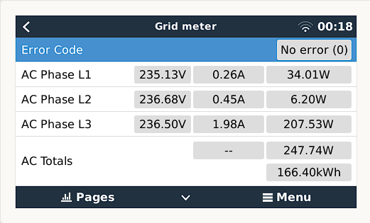
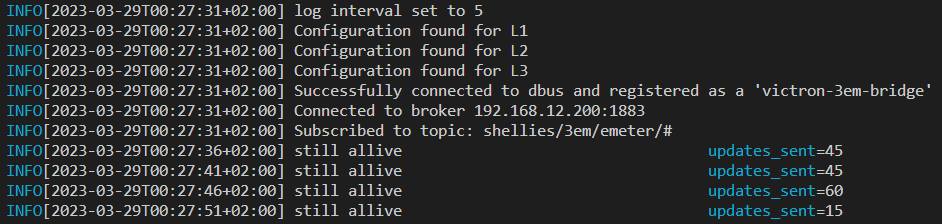

# Victron MQTT bridge 

This work is based on 2 repos.

* Python implementation of [Fabian Lauer](https://github.com/fabian-lauer/dbus-shelly-3em-smartmeter)
* Golang implementation of [stormmurdoc](https://github.com/stormmurdoc/victron_sdm630_bridge)

The goal was to make a MQTT bridge which supports all sorts of EM meters as long long as they store their data in an MQTT server and add a YAML file for configuring it.

## Features
* Golang executeable which should be way faster and easier to setup
* Reactive rather then proactive
* Use any MQTT topic as long as the subtopics are no JSON objects.
* Will work with one phase only. L2 and L3 will just be left with default values which is still enough for the Victron.
* Will work with only Power as input! I had a SML reader before and its only output was power, which is enough to calculate the missing values.
  - Autogenerates `current` based on `power` and `voltage`
  - able to set default for Voltage in case its missing





# Configuration

You need to change the default values in the `victron-mqtt-bridge.yaml` file:
```yaml
loglevel: trace                         #loglevels are: "info,warn,debug,trace", remove to disable logging
loginterval: 3600                       #time in secods to write periodic logs. default: 3600
updateinterval: 0 #updates to the DBUS > 0 = live on power changes, otherwhise in miliseconds
#dryrun: true                           #disables dbus connection, for testing only
client_id: "victron-3em-bridge"         #Name inside Victron

#mqtt config, most likley the only thing you need to change
broker: 192.168.12.200
port: 1883
user: 
password: 
topic: shellies/3em/emeter/#            #base topic. the "#" will subscribe to ALL topics beneath it

# Required, if if you 
L1:
  #default values in case some topic is missing
  voltage: 230.0
  current: 0.0
  power: 0.0
  imported: 0.0
  exported: 0.0
  #relative path from topic, just write "something" if it's unassigned
  topic:
    Power: 0/power                      #will result in 'shellies/3em/emeter/0/power'   
    Voltage: 0/voltage                  #...
    Current: 0/current
    Imported: 0/total
    Exported: 0/total_returned

#Remove if you only have 1 phase to track
L2:
  voltage: 230.0
  current: 0.0
  power: 0.0
  imported: 0.0
  exported: 0.0
  topic:
    Power: 1/power
    Voltage: 1/voltage
    Current: 1/current
    Imported: 1/total
    Exported: 1/total_returned

#Remove if you only have 1 phase to track
L3:
  voltage: 230.0
  current: 0.0
  power: 0.0
  imported: 0.0
  exported: 0.0
  topic:
    Power: 2/power
    Voltage: 2/voltage
    Current: 2/current
    Imported: 2/total
    Exported: 2/total_returned
```

# Installing

1. [Download](https://github.com/achmed20/victron_energymeter_mqtt/releases) and extract the latest release and extract it into `/data` or execute this script!
```sh
wget -c https://github.com/achmed20/victron_energymeter_mqtt/releases/latest/download/release.tgz -O - | tar -xz -C /data
```
2. modify the config
```
nano /victron-mqtt-bridge.yaml
```
3. Test it by starting it it manualy. If you dont get errors, and the GX UI is showing values, just reboot
```sh
/data/victron-mqtt-bridge
```

## Compiling from source

Compile it with
```sh
make build
```
This will create a `.build` folder with all the files you need

# Troubleshooting

* make sure your MQTT server is correct
* make sure your topics are correct
* take a look at the logfile under `/data/victron-mqtt-bridge.log` for startup errors

# Basic debugging

start `/data/victron-mqtt-bridge` by hand. and look for errors

## Advanced debugging

Try changing the loglevel to trace in `/data/victron-mqtt-bridge.yaml`
```yaml
loglevel: trace
```
**make sure to set it back to `info` once your problem is solved**

### Values dont change?
Search the output for `path not found, creating dummy`! If you  have those, its likely that either your main `topic` or the topics of `L1-L3` are wrong

